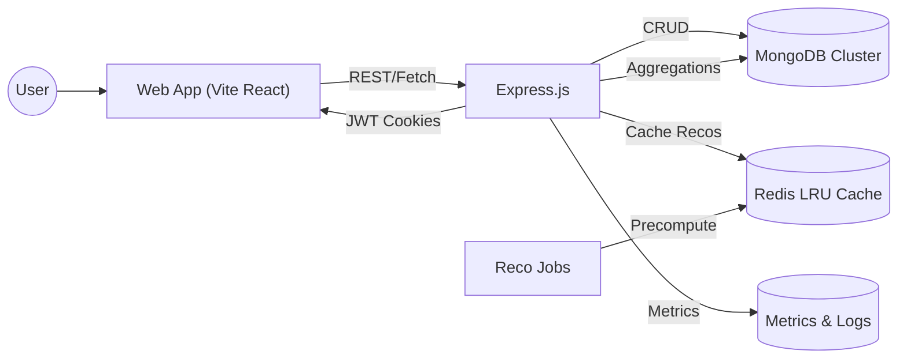

# Architecture Overview

The SPA communicates with the Fastify API via HTTPS using httpOnly cookie authentication. The API persists data in MongoDB, caches recommendation payloads in Redis, and exposes observability endpoints. A scheduled recommendation job precomputes similarity matrices and warms caches.
