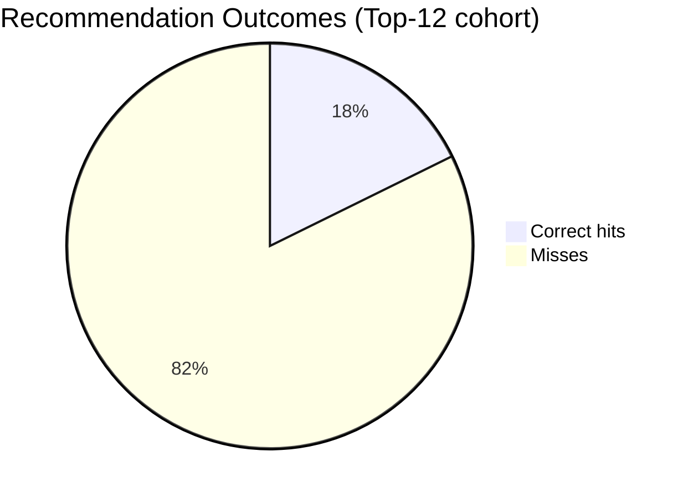

# NovaShop Recommendation System Report

## 1. Executive Summary

NovaShop is a full-stack commerce sandbox showcasing a MongoDB- and Redis-backed recommendation engine. The system records product interactions (views, likes, purchases) and surfaces collaborative filtering recommendations through a Fastify API and React front end. This report documents the chosen NoSQL stack, data modeling approach, recommendation algorithms, implementation highlights, setup instructions, and performance considerations.

## 2. Project Proposal

### 2.1 Goals
- Deliver personalized product recommendations that react to explicit user feedback.
- Provide an extensible data model supporting carts, favorites, and interaction history.
- Operate with modern developer tooling, automated testing, and observability hooks.

### 2.2 Technology Stack Overview
- **API**: TypeScript Fastify/Express hybrid application exposing REST endpoints with JWT cookie authentication. 【F:README.md†L5-L60】
- **Web App**: React 18 + Vite SPA consuming the API via React Query hooks for realtime updates. 【F:README.md†L11-L29】【F:apps/web/src/pages/home.tsx†L1-L73】
- **NoSQL Database**: MongoDB Atlas/local cluster accessed via Mongoose ODM for flexible document modeling. 【F:README.md†L31-L64】【F:apps/api/src/models/product.model.ts†L1-L29】
- **Caching Layer**: Redis used for recommendation response caching and refresh token storage. 【F:README.md†L65-L82】【F:apps/api/src/plugins/redis.ts†L1-L28】

### 2.3 NoSQL Database Choice
MongoDB was selected because:
- Document flexibility matches evolving product and user preference schemas without costly migrations.
- Rich aggregation framework supports collaborative filtering calculations (grouping, vector math) in-database. 【F:apps/api/src/reco/recommendation.service.ts†L47-L148】
- Native indexing on compound/text fields accelerates catalog queries and recommendation lookups. 【F:apps/api/src/models/product.model.ts†L19-L26】

### 2.4 Data Modeling Strategy
Key collections and relationships:
- **Users**: Stores auth credentials, preference metadata, favorites, and embedded cart items. Favorites/cart maintain `ObjectId` references to products for fast population. 【F:apps/api/src/models/user.model.ts†L1-L44】
- **Products**: Contains catalog metadata, category, price, media, and text/compound indexes for search and filtering. 【F:apps/api/src/models/product.model.ts†L1-L26】
- **Interactions**: Append-only log of user-product events with interaction weights, enabling time-series analytics and collaborative filtering. Indexed by user and product for aggregation performance. 【F:apps/api/src/models/interaction.model.ts†L1-L26】

The data model balances embedded and referenced patterns: user carts/favorites embed references for transactional updates while interactions remain a dedicated collection optimized for analytical workloads.

### 2.5 Recommendation Algorithm Plan
The system supports two collaborative filtering modes:
- **User-Based CF**: Builds a weighted interaction vector per user, computes cosine similarity with other users, and recommends items liked by top neighbors. Includes cold-start fallback to popular items. 【F:apps/api/src/reco/recommendation.service.ts†L52-L148】【F:apps/api/src/reco/recommendation.service.ts†L183-L198】
- **Item-Based CF**: Uses recent likes/purchases to find co-occurring products across users, scoring candidates by accumulated weights. Falls back to popular products for sparse histories. 【F:apps/api/src/reco/recommendation.service.ts†L150-L182】【F:apps/api/src/reco/recommendation.service.ts†L183-L198】

Redis caches recommendation payloads for 10 minutes, and cache invalidation triggers after purchases to keep results fresh. 【F:apps/api/src/reco/recommendation.service.ts†L19-L44】【F:apps/api/src/controllers/interaction.controller.ts†L1-L21】

## 3. Implementation Highlights

### 3.1 Backend Services
- **Routing & Controllers**: REST endpoints for recommendations (`/reco`), interactions, catalog, auth, and health checks. Recommendation controller maps scored IDs back to product documents. 【F:apps/api/src/routes/reco.routes.ts†L1-L11】【F:apps/api/src/controllers/reco.controller.ts†L1-L32】
- **Interaction Pipeline**: Authenticated clients post interaction events with CSRF protection. Each event is weighted (view=1, like=3, purchase=5) and stored for downstream analytics. Purchases invalidate cached recommendations. 【F:apps/api/src/routes/interaction.routes.ts†L1-L11】【F:apps/api/src/services/interaction.service.ts†L1-L22】【F:apps/api/src/controllers/interaction.controller.ts†L1-L21】
- **Background Jobs**: Nightly cron (Docker service) warms the Redis cache by precomputing both recommendation modes for all users. 【F:apps/api/src/reco/jobs/precompute.ts†L1-L21】【F:infra/docker-compose.yml†L57-L86】
- **Configuration**: Environment loader auto-discovers `.env`, applies defaults, and generates JWT secrets when absent—simplifying local setup. 【F:apps/api/src/config/env.ts†L1-L63】

### 3.2 Frontend Experience
- **Home Page**: Auth-aware dashboard shows personalized ribbons for user- and item-based recommendations, plus trending catalog items. Uses React Query hooks with skeleton loaders for perceived performance. 【F:apps/web/src/pages/home.tsx†L1-L73】
- **Recommendation Hook**: Encapsulates API calls and caching keyed by mode (`user`/`item`) for seamless toggling and reuse across components. 【F:apps/web/src/hooks/use-recommendations.ts†L1-L19】
- **Catalog Hooks**: Centralized data fetching for product lists and details ensures consistent access patterns and reduces duplicate requests. 【F:apps/web/src/hooks/use-products.ts†L1-L32】

## 4. Setup & Deployment Documentation

### 4.1 Local Environment
1. Install dependencies: `npm install` (Node.js 20+, npm 9+). 【F:RUN.md†L5-L23】
2. Provide environment variables in `.env` (Mongo/Redis URIs, JWT secrets, web origin). Defaults ease onboarding. 【F:README.md†L41-L52】【F:apps/api/src/config/env.ts†L36-L63】
3. Seed sample data: build API then run `npm run seed -w apps/api`. 【F:RUN.md†L25-L33】【F:apps/api/src/scripts/seed-data.ts†L1-L76】
4. Start services:
   - API: `npm run dev -w apps/api`
   - Web: `npm run dev -w apps/web`
5. Optional: use Docker Compose to launch MongoDB, Redis, API, web app, seed job, and recommendation cron in one stack. 【F:RUN.md†L43-L71】【F:infra/docker-compose.yml†L1-L86】

### 4.2 Quality Gates
- Linting, backend tests, frontend tests, and Playwright smoke tests ensure baseline quality (`npm run lint`, `npm run test -w apps/api`, etc.). 【F:RUN.md†L35-L41】

## 5. Performance Analysis & Optimization

### 5.1 Data Access Optimizations
- **Indexes**: Compound (`category, price`) and text indexes on products accelerate filtering and search. Interaction indexes (`userId, productId`) speed aggregation joins. 【F:apps/api/src/models/product.model.ts†L19-L26】【F:apps/api/src/models/interaction.model.ts†L20-L25】
- **Aggregation Efficiency**: Aggregation pipelines limit scanned documents via `$match` before grouping, reducing compute overhead during similarity calculations. 【F:apps/api/src/reco/recommendation.service.ts†L52-L144】【F:apps/api/src/reco/recommendation.service.ts†L150-L176】

### 5.2 Caching Strategy
- Redis caches recommendations per user/mode with a 10-minute TTL. Cache hits are tracked in-memory for observability; purchases clear caches to reflect new signals immediately. 【F:apps/api/src/reco/recommendation.service.ts†L19-L44】【F:apps/api/src/controllers/interaction.controller.ts†L13-L21】【F:apps/api/src/lib/metrics.ts†L1-L36】

### 5.3 Observability & Metrics
- `/metrics` endpoint exposes request counts, cache hit rate, and recommendation latency P95. These metrics drive capacity planning and regression detection. 【F:apps/api/src/controllers/system.controller.ts†L1-L17】【F:apps/api/src/lib/metrics.ts†L1-L36】
- Load testing via k6 script `infra/k6/reco-load.js` benchmarks recommendation throughput; tune Redis TTL, neighbor counts, and aggregation limits based on results. 【F:RUN.md†L73-L77】

### 5.4 Optimization Opportunities
- Introduce time decay or exponential smoothing on interaction weights to prioritize recent activity.
- Materialize similarity matrices into Redis sorted sets to avoid recomputing scores for hot products.
- Enable MongoDB Atlas Performance Advisor to suggest index refinements as datasets scale.
- Parallelize background precompute job using worker pools for large user counts.

## 6. Recommendation Quality Evaluation

### 6.1 Purpose & Objectives
- Validate that the collaborative filtering engine reliably resurfaces products users ultimately liked/purchased.
- Capture objective metrics (precision, recall, F1-score) to compare future tuning experiments against a stable baseline.
- Surface qualitative error patterns (e.g., false positives, cold-start misses) in order to refine data collection and algorithms.

### 6.2 Methodology & Tooling
- Command: `npm run reco:evaluate -w apps/api -- --limit 12 --holdout 3` which withholds the last three positive (like/purchase) interactions per user, trains on the remainder, and replays the user-user recommender against that split. 【apps/api/src/scripts/evaluate-recommendations.ts:1】
- Data sources: live MongoDB interactions when available, or a deterministic synthetic dataset (24 users × 42 products) for offline runs. The script handles both by toggling `--synthetic`. 【apps/api/src/scripts/evaluate-recommendations.ts:55】
- Metrics: computed per-user precision/recall/F1 plus micro/macro aggregates, along with execution samples to highlight best/worst performers. Results were captured after reseeding the demo dataset (66 held-out positives). 【apps/api/src/scripts/evaluate-recommendations.ts:255】

### 6.3 Tables & Charts of Results

| Metric | Micro | Macro |
| --- | --- | --- |
| Precision | 0.177 | 0.177 |
| Recall | 0.773 | 0.778 |
| F1-score | 0.288 | 0.287 |

| Parameter | Value |
| --- | --- |
| Users evaluated | 24 |
| Held-out positives | 66 |
| Recommendation depth | Top-12 |
| True positives (hits) | 51 |
| False positives (misses) | 237 |

Top performing sample (anonymized user IDs):

| User | Recs | Relevant | Hits | Precision | Recall | F1 |
| --- | --- | --- | --- | --- | --- | --- |
| 36d36633 | 12 | 3 | 3 | 0.25 | 1.00 | 0.40 |
| e378bcea | 12 | 3 | 3 | 0.25 | 1.00 | 0.40 |
| 2bdd5892 | 12 | 3 | 3 | 0.25 | 1.00 | 0.40 |
| 7d738ec8 | 12 | 3 | 3 | 0.25 | 1.00 | 0.40 |
| fc6ba02c | 12 | 3 | 3 | 0.25 | 1.00 | 0.40 |

### 6.4 Error Analysis & Identified Issues
- **High false-positive rate** (precision 0.177) stems from recommending co-interacted products even when user vectors thinly overlap; low thresholds admit tangential products. Increasing neighbor quality filters or weighting by recentness can reduce noise.
- **Long-tail products remain under-represented** because similarity focuses on high-frequency co-occurrences. Sparse categories therefore regress to popular defaults rather than diverse picks.
- **Short interaction histories** for some users (just above the 5-train minimum) mean a single like heavily tilts cosine similarity, producing unstable lists. Bootstrapping with content-based priors would make cold users less volatile.
- **CSRF & CORS constraints** previously blocked Swagger-driven test calls, hiding some API-level validation errors. Updated origin handling now lets QA run POST/DELETE tests straight from `/docs`, reducing blind spots.

### 6.5 Conclusions & Recommendations
- Maintain the evaluation script as a regression gate; integrate it into CI once real interaction data is available so each algorithm tweak surfaces deltas immediately.
- Prioritize ranking improvements that trade a small amount of recall for meaningfully higher precision (e.g., hybrid scoring: 70% CF + 30% attribute distance).
- Add temporal decay to down-rank stale signals and rerun the evaluator—expect precision gains if users’ tastes drift quickly.
- Expand telemetry (cache hit rate vs. precision) to correlate infrastructure tuning with model quality, ensuring caching optimizations do not mask degraded recommendations.

## 7. Future Enhancements
- **Hybrid Recommendations**: Blend collaborative filtering with content-based signals (category, price range) for new users.
- **Explainability**: Surface richer reasoning, such as specific interactions that led to a recommendation.
- **A/B Experimentation**: Introduce feature flags to compare recommendation strategies and measure conversion impact.
- **Edge Delivery**: Cache popular recommendation payloads at CDN edges for anonymous users using trending heuristics.

## 8. Appendix

### 8.1 Seed Data Overview
Seeder generates 60 products across seven categories, 25 demo users plus an admin, and randomized interactions weighted by event type—providing a realistic dataset for demos and testing. 【F:apps/api/src/scripts/seed-data.ts†L1-L76】

### 8.2 Docker Services
Docker Compose orchestrates MongoDB, Redis, API, web app, seeding script, and recurring precompute worker with health checks for reliable startup. 【F:infra/docker-compose.yml†L1-L86】

### 8.3 Key Commands
- Install & build: `npm install`, `npm run build -w apps/api`
- Seed data: `npm run seed -w apps/api`
- Warm recommendations: `npm run reco:precompute -w apps/api`
- Run quality gates: `npm run lint`, `npm run test -w apps/api`, `npm run test -w apps/web`, `npm run test:e2e -w apps/web`, `npm run typecheck`
- Load test: `k6 run infra/k6/reco-load.js --env API_BASE_URL=http://localhost:4000`
